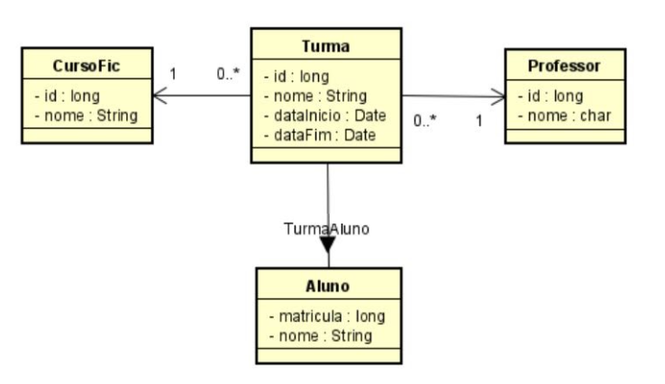

# FIC course management system

## TEAM

|Nome|Matricula|Api|
|-|-|-|
|GUILHERME DE SOUSA PEIXOTO| 2019003074 | Turma(classes) |
|KEVEN LUCAS PAIVA DE PAULA| 2019003083 | Professor(professor) |
|MARIO GUILHERME CARVALHO| 2019007940 | Aluno(fic-student) |
|REBECA CANCELLI ARCHER PINTO| 2019003181 | CursoFic(fic-course) |

### CLASS DIAGRAM


### TECHNOLOGIES USED
* back-end: [NEST.JS](https://nestjs.com/)
* front-end: [ANGULAR](https://angular.io/)

## REQUIREMENTS 
This project requires docker and docker-compose.

## RUNNING PROJECT
clone this repository on your machine 
```bash
$ git clone https://github.com/glrmeslp/FIC-course-management-system.git
```
enter the project 
```bash
$ cd FIC-course-management-system
```
There is a docker-compose.yml file for starting Docker.

```bash
$ docker-compose up --build

```

After running the sample, you can stop the Docker container with

```bash
$ docker-compose down
```
Acess [http://localhost:3000/classes](http://localhost:3000/classes) to acess Turma(classes)
Acess [http://localhost:3000/professor](http://localhost:3000/professor) to acess Professor(professor)
Acess [http://localhost:3000/fic-student](http://localhost:3000/fic-student) to acess Aluno(fic-student)
Acess [http://localhost:3000/fic-course](http://localhost:3000/fic-course) to acess CursoFic(fic-course)

